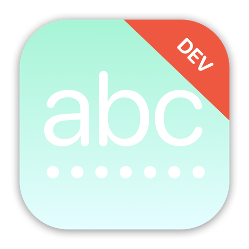

    

    
    
    

  ***Note**: The app icon above should only be used for development purposes only, not for submission to the App Store due to the license on SF Symbols and Emoji.*

 

WordScramble is a word creation game app designed to test players English vocabulary, similar to the iconic board game Scrabble.

The app interface contains a simple list of 3 sections; the randomly-generated word by the app, the input field for the player's answer, and a list of previously used words by the player. In a nutshell, the game will show players a random eight-letter word, and ask them to make words out of it.

After the player submits their answer, each submitted word will show up under the used words section with a word count.

For example, if the starter word is *“swift”* the player might spell *"fit"*, *“it”*, *“wit”*, and so on. The player submitted the word *"fit"* will have a label "③" on its left side and *"fit"* will be listed under the used word section and it can no longer be used for the current game round.

There are a total of 3 conditions built into the game where it will check every time the player submits their answer:

* The submitted word must not already been used previously.
* The submitted word must be a recognizable English language word.
* The letters in the submitted word must match all the available letters in the given generated word.

To start a new round with a new random word, players can simply tap on the Restart button at the top right of the app. The list of previously used words are not being stored so every new game round will also removed any words used in the previous game round.

## Trying it yourself

WordScramble is written using Xcode 13.2 and Swift 5.0. To try it out, you can clone this project and build it immediately by opening `WordScramble.xcodeproj`.

As far as I know the app feature is complete, but there are likely to be errors all over the place at least to begin with – if you hit any problems, either building or running the app, please let me know.

## Important notes on usage

Keep in mind that this app is simply a project designed and built for my own personal educational purposes only. The sole purpose for this app project was to gain practical experience in building an app in iOS with Swift & SwiftUI. The state of this app was never meant to be production-ready, published onto the App Store, or to be monetized in any way, shape, or form.

If you wish to do any of the above, you will have to make some changes to the app before submitting to the App Store for approval. Please keep in mind of any potential violation of third-party license, such as the usage of SF Symbols and/or Emoji of the app icon.

## Credits

Swift, the Swift logo, Xcode, Instruments, SF Symbols, Emoji, Cocoa Touch, iPhone, iPad, Safari, App Store, watchOS, tvOS, Mac and macOS are trademarks of Apple Inc., registered in the U.S. and other countries.

## License 

This project is under the terms of the MIT license. For more information, please refer to the license [documentation](LICENSE).